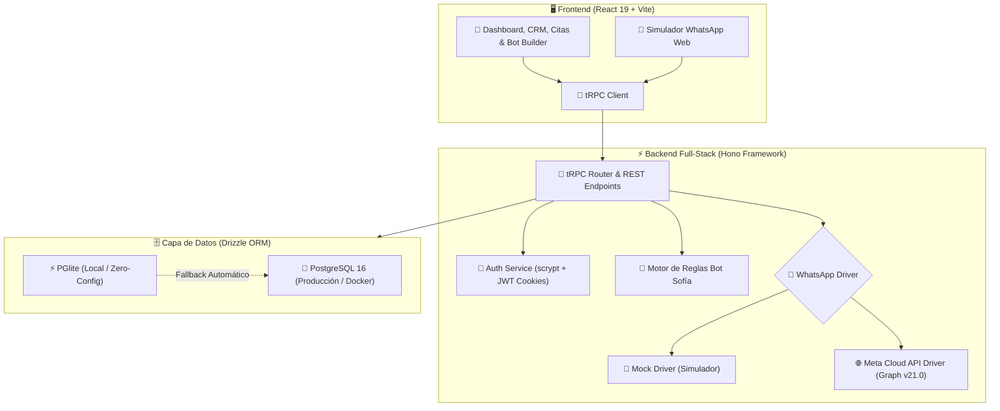

# 💅 WhatsBot — Glam Nails Maturín
### CRM Inteligente, Agenda de Citas y Automatización de Atención al Cliente vía WhatsApp

<p align="center">
  
  
  
  
  
  
  
  
  
</p>

---

## 🌸 Descripción General

**WhatsBot — Glam Nails Maturín** es una plataforma integral de **CRM y Asistente Virtual para WhatsApp** diseñada exclusivamente para salones boutique de belleza y manicure. Desarrollada para automatizar las consultas informativas de alta demanda, agilizar el agendamiento y confirmación de citas, supervisar conversaciones en tiempo real y gestionar comprobantes de Pago Móvil con tasa oficial del BCV.

El sistema opera bajo un **patrón de doble controlador (Driver Pattern)**: permite realizar pruebas inmediatas en el **Simulador WhatsApp Web interactivo** sin costo ni credenciales, o conectarse directamente a la **API Oficial de Meta (WhatsApp Business Cloud API Graph v21.0)** para operar con números reales.

---

## ✨ Características Principales

### 🤖 1. Asistente Virtual Inteligente (Bot Sofía)
- **Motor NLP de Priorización Semántica**: Discierne inteligentemente entre saludos simples e intenciones reales de negocio. Si una clienta escribe *"Hola, necesito cancelar mi cita"*, el motor descarta el saludo genérico y ejecuta de inmediato la regla de cancelación.
- **Detección de Servicios & Precios**: Reconoce variantes de servicios (acrílicas esculpidas, soft gel, kapping, baño de acrílico, semipermanente, pedicure spa, nail art).
- **Control de Horario Comercial**: Responde con mensajes automáticos de cortesía fuera del horario laboral (martes a sábado de 9:00 am a 5:00 pm).
- **Menú de Fallback Guiado**: Ante mensajes no reconocidos, ofrece un menú claro con accesos directos en vez de reiterar el saludo.
- **Escalado Humano en 1 Clic**: El bot se silencia automáticamente cuando la clienta pide hablar con una asesora o cuando la recepcionista decide intervenir manualmente.

### 💬 2. CRM de Conversaciones en Tiempo Real
- **Interfaz WhatsApp Web Boutique**: Paleta de colores elegante inspirada en salones de lujo (Rose Gold `#FAF9F6`, verde menta recepcionista, rosa suave bot).
- **Sincronización Continua**: Mensajes actualizados cada 3 segundos sin recargar la página.
- **Plantillas de Respuesta Rápida (1-Clic)**: Accesos directos a precios, ubicación, datos de pago móvil, horario y confirmación.
- **Visor Multimedia**: Zoom modal para consultar capturas de Pago Móvil y diseños de uñas enviados por las clientas.
- **Ficha de la Clienta (Dossier Flotante)**: Ventana modal responsiva con historial de citas, estatus de fidelidad VIP, total de inversión acumulada y agendamiento exprés.

### 📅 3. Módulo de Citas y Calendario de Agenda
- **Vista Dual**: Alterna con un clic entre **Vista Lista de Citas** y **Vista Calendario Mensual**.
- **Acciones Rápidas**: Confirmación y notificación automática a la clienta por WhatsApp en un toque.
- **Estados de Cita**: Control visual por estados (*Pendiente*, *Confirmada*, *Completada*, *Cancelada*).
- **Precios Multi-Moneda**: Visualización de tarifas en Dólares ($ USD) y Bolívares (Bs) a tasa oficial referencial del BCV.

### 🧪 4. Simulador WhatsApp Web Integrado
- **Ambiente de Pruebas Seguro**: Simula un teléfono móvil dentro del navegador para probar cómo responde el bot ante cualquier mensaje.
- **Botones de Prueba Rápida**: Botones listos para probar preguntas frecuentes con un solo clic (*"¿Precios?"*, *"¿Tienen cita para hoy?"*, *"Datos de Pago Móvil"*, *"Cancelar cita"*).

### 🛡️ 5. Autenticación Nativa y Seguridad
- **Sin Dependencias Externas Propietarias**: Desacoplado de servicios de terceros (AWS Cognito, Kimi OAuth, etc.).
- **Seguridad Criptográfica**: Hashing de contraseñas con sal y derivación criptográfica nativa de Node.js (`crypto.scrypt`).
- **Sesiones HTTP-only**: Cookies de sesión seguras firmadas con JWT (`SameSite=Lax`, `HttpOnly`).
- **Control de Acceso Basado en Roles (RBAC)**: Procedimientos tRPC protegidos (`authedProcedure` y `adminProcedure`).

---

## 🏛️ Arquitectura del Sistema



---

## 🛠️ Stack Tecnológico

| Capa | Tecnologías |
| :--- | :--- |
| **Frontend** | React 19, TypeScript, Vite, Tailwind CSS v4, Lucide Icons, Radix UI, Sonner, date-fns |
| **Backend** | Node.js 20+, Hono, TypeScript, tRPC v11, esbuild |
| **Persistencia** | Drizzle ORM, PostgreSQL 16, PGlite (Postgres WebAssembly embebido en Node.js) |
| **Mensajería** | WhatsApp Business Cloud API v21.0, Webhooks de Meta con verificación HMAC SHA-256 |
| **Testing** | Vitest (26 pruebas unitarias del motor de intenciones) |
| **DevOps** | Docker, Docker Compose, Multi-stage builds |

---

## 🚀 Inicio Rápido (Local)

### Requisitos Previos
- **Node.js** 20.x o superior
- **npm** 10.x o superior
- *(Opcional)* **Docker** y **Docker Compose** para PostgreSQL externo

### 1. Clonar el Repositorio
```bash
git clone https://github.com/jyersonrp/WhatsBot-GlamNails.git
cd WhatsBot-GlamNails
```

### 2. Instalar Dependencias
```bash
npm install
```

### 3. Configurar Variables de Entorno
Copia el archivo de ejemplo:
```bash
cp .env.example .env
```
> **Nota:** La aplicación incluye valores predeterminados para desarrollo local. No requiere ninguna configuración obligatoria para iniciar con la base de datos embebida (PGlite).

### 4. Compilar y Ejecutar
```bash
# Compilar frontend y backend
npm run build

# Iniciar servidor en producción local
npm start
```
Abre tu navegador en: **`http://localhost:3000`**

### 🔑 Credenciales de Acceso Inicial
- **Email:** `admin@glamnails.com`
- **Contraseña:** `admin123`
*(O crear una cuenta con tu propio correo desde la pantalla de Login)*

---

## 🐳 Despliegue con Docker

Para levantar la aplicación completa junto a PostgreSQL 16 en un contenedor aislado:

```bash
docker-compose up --build -d
```
El servicio estará disponible en `http://localhost:3000`.

---

## 🧪 Pruebas Unitarias y Calidad

El proyecto incluye suites completas de pruebas automatizadas y chequeo estricto de tipos:

```bash
# Ejecutar suite de pruebas unitarias (Vitest)
npm test

# Verificación estricta de tipos TypeScript
npm run check

# Auditoría de calidad de código (ESLint)
npm run lint
```

---

## 📂 Estructura del Proyecto

```
WhatsBot-GlamNails/
├── api/                       # Backend full-stack con Hono & tRPC
│   ├── lib/                   # Autenticación, JWT, cookies, crypto y base de datos
│   ├── queries/               # Operaciones Drizzle ORM por entidad
│   ├── services/              # Motor de reglas Sofía y Drivers de WhatsApp
│   │   ├── botRulesEngine.ts  # NLP y priorización de intenciones
│   │   └── whatsappDriver.ts  # Meta Cloud API y Mock Driver
│   ├── appointment-router.ts  # Router de citas y agenda
│   ├── service-router.ts      # Router de catálogo de servicios
│   ├── webhook-router.ts      # Webhook oficial de Meta WhatsApp
│   └── boot.ts                # Entrypoint de arranque del servidor
├── db/                        # Esquemas y migraciones Drizzle
│   ├── migrations/            # Migraciones SQL versionadas
│   ├── schema.ts              # Modelado relacional en PostgreSQL
│   └── seed-salon-unas.ts     # Semillas iniciales del salón Glam Nails
├── src/                       # Frontend SPA (React 19 + Tailwind CSS)
│   ├── components/            # Sidebar, Header, Modales, Simulador WhatsApp
│   ├── pages/                 # Dashboard, Citas, CRM Conversaciones, Reglas, Login
│   ├── providers/             # Proveedores React Query y tRPC Client
│   └── index.css              # Estilos globales y paleta Salón Boutique
├── tests/                     # Pruebas automatizadas (Vitest)
├── Dockerfile                 # Imagen multi-stage para producción
├── docker-compose.yml         # Orquestación con PostgreSQL 16
└── README.md                  # Documentación oficial del proyecto
```

---

## 👩‍💻 Autor y Créditos

Proyecto desarrollado y modernizado por **Yerson Rodríguez** ([@jyersonrp](https://github.com/jyersonrp)).  
Inspirado en la automatización operativa y atención al cliente del salón **Glam Nails Maturín**.

---

<p align="center">
  Hecho con 💅 y ☕ para salones de belleza modernos.
</p>
